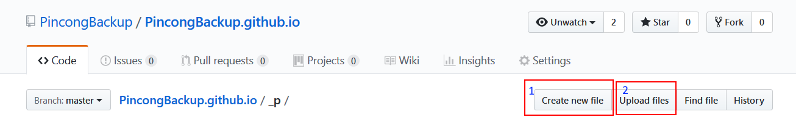
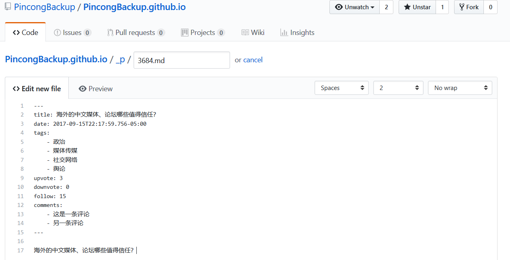
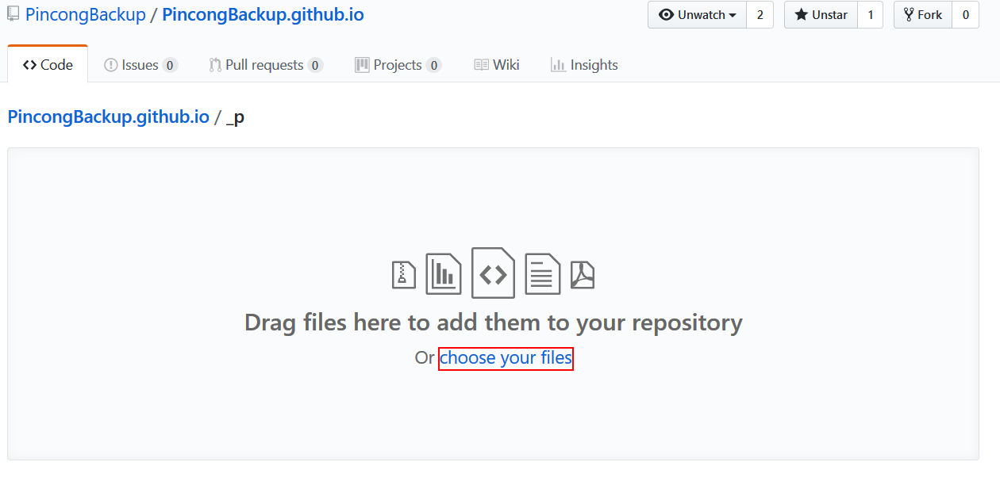
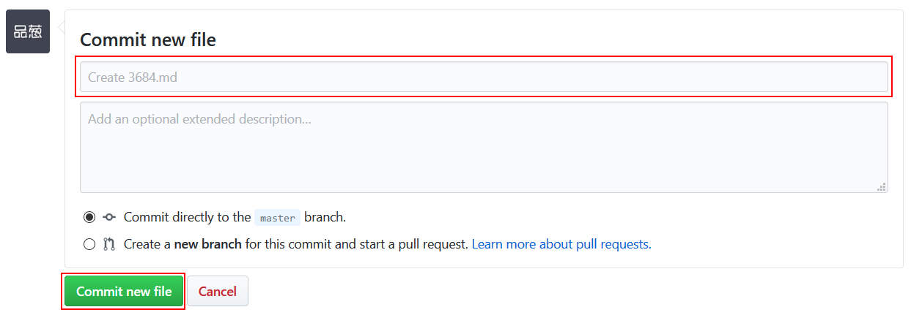
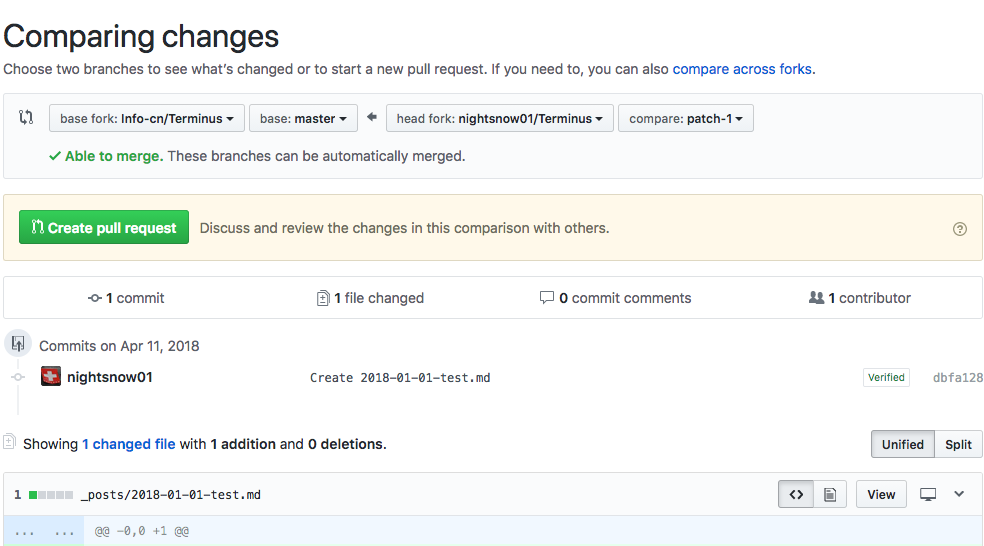
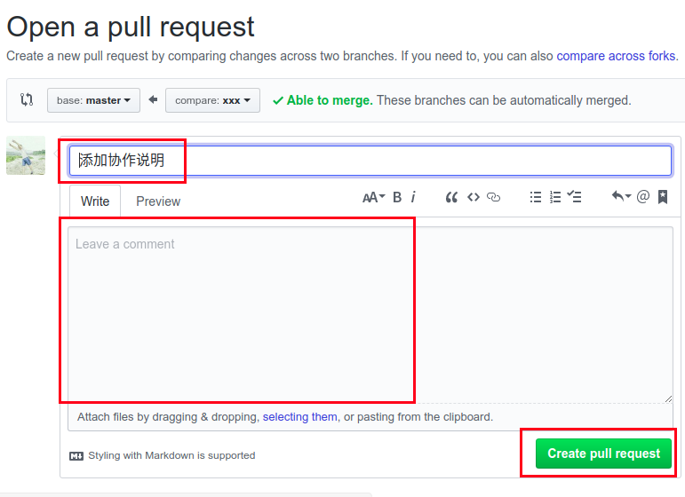
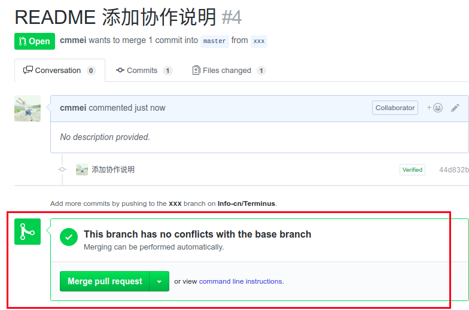

## 需要的基本技能

- 熟悉使用 Markdown 基本标记语法
- 熟悉 Markdown 文本编辑器（可选项）：这些工具适用于对 Markdown 语法不熟悉的协作者
  - [Typora](https://typora.io)
  - [VS Code](https://code.visualstudio.com/)
  - html 转成 markdown：浏览器插件「[简悦](http://ksria.com/simpread/)」
- 熟悉 GitHub 平台使用（可选项）
- 熟悉 Git 工具使用（可选项）

## 协作步骤说明

1. 注册并登录 [GitHub](https://github.com/) 帐号

2. 访问 [品葱备份计划](https://github.com/PincongBackup/PincongBackup.github.io) GitHub页面

3. 点击进入 [_p](https://github.com/PincongBackup/PincongBackup.github.io/tree/master/_p) 文件夹，创建备份品葱问题的 Markdown 文件

    > 文件命名规则：原问题的问题id + 扩展名 `.md`，如 `3684.md`。

    共有三种方式：

    

    - 第一种：点击 **Create new file** 在线编辑

        

        1. 在 `_p/` 后面的框内输入文件名，如 `3684.md`。
        2. 在下方 `Edit new file` 空白区域以 markdown 语法编辑文章
        3. 点击 `Preview` 可预览效果

    - 第二种：**Upload files**

        

        1. 点击 `Upload files`
        2. 从本地将编辑好的 markdown 格式备份文档上传

    - 第三种：使用 Git 

        请参考 [Git 教程](https://git-scm.com/book/zh/v2)

4. 进入 [_answers](https://github.com/PincongBackup/PincongBackup.github.io/tree/master/_answers) 文件夹，备份问题的回答，方法同 `3`

    > 文件命名规则：问题id + `/` + 回答id（若无法获取，可自定义）+ 扩展名 `.md`，如 `3684/3691.md`。
    > 
    > （请在 `_answers` 后面的输入框内输入，问题id 和 `/` 输入后将自动变为文件路径的一部分）

5. 提交 **commit changes**

    在下方填写 commit changes ，简单说明提交的修改是什么

    

6. 创建 **pull request** 拉取请求  

    点击 **`Creat Pull requests`**，将刚才新建并进行的分支修改提交到 master 主项目，发起拉取请求

    

7. 编辑 pull 请求

    点击 **`Create pull request`** 之后，在新的页面 **open a pull request** 中编辑请求说明

    

    检查分支与 master 是否存在冲突，若无冲突，则可以合并，经创建者同意，可把分支新增内容加入到 master 主项目中。

    如下图，显示 **This branch has no conflicts with the base branch**，则表示提交的分支请求和 master 无冲突。

    

8. 合并请求同意后，会显示紫色

    

## 协作的文档编辑格式要求

1. 每个品葱问题的备份，开头都需要说明标题、提问日期和时间（使用 [ISO 8601](https://zh.wikipedia.org/wiki/ISO_8601) 格式，只需精确到日期）、标签、赞同数量、反对数量、关注者数量、关于问题的评论。格式如下：

    <pre><code>---
    title: 海外的中文媒体、论坛哪些值得信任？
    date: 2017-09-15T22:17:59.756-05:00
    tags:
        - 政治
        - 媒体传媒
        - 社交网络
        - 舆论
    upvote: 3
    downvote: 0
    follow: 15
    comments:
        - 这是一条评论
        - 另一条评论
    ---</code></pre>

    空白模板：
    <pre><code>---
    title: 
    date: 
    tags: 
    upvote: 
    downvote: 
    follow: 
    comments: 
    ---</code></pre>

    其中必填项是 标题 (`title`) 和 提问日期和时间 (`date`) ，提问时间如无法获取，可参考前后两个问题的提问时间

2. 每个问题回答的备份，开头都需要说明 回答日期和时间（格式同提问日期和时间）、回答者的用户名、回答者的用户自我介绍、回答者的用户头像、赞同数、反对数、评论。格式如下：

    <pre><code>---
    date: 2017-09-16T10:23:18.600-05:00
    user_name: 机械牛A
    user_intro: 努力提高姿势水平
    user_avatar: /static/upload/thumb/small50-u-thumb-11696b84c91035851a307f29fb3723d39ee293be024.png
    upvote: 33
    downvote: 0
    comments:
        - 这是一条评论
    ---</code></pre>

    空白模板：
    <pre><code>---
    date: 
    user_name: 
    user_intro: 
    user_avatar: 
    upvote: 
    downvote: 
    comments: 
    ---</code></pre>

    全部都是可选项

    如果 回答日期和时间 (`date`) 留空，将自动默认为问题的提问时间

3. 正文小标题，使用 h2 或 h3。

4. 图片使用 [https://sm.ms](https://sm.ms) 、 [https://imgur.com](https://imgur.com) 或 [https://img9.top/](https://img9.top/) 图床平台生成链接，或者内嵌 base64 字符串 [DataURL](https://developer.mozilla.org/zh-CN/docs/Web/HTTP/data_URIs)。

## 我能在哪里寻找到零散的旧品葱内容？

* Google WebCache
    在搜索框中输入 `site:www.pin-cong.com` [定向搜索](https://www.google.com/search?q=site:www.pin-cong.com)，然后点击 `▼查看快照`

* [Internet Archive (archive.org)](https://web.archive.org/web/sitemap/pin-cong.com)

* [archive.fo (原 archive.is、archive.today)](http://archive.fo/)

* [telegram 品葱搬运工](https://t.me/todayfreedom)

* 自己的私人笔记、存档（可能）

* 自己的屏幕截图（可能）

> 内容修改自 [如何协作参与端点星计划](https://github.com/Terminus2049/Terminus2049.github.io/blob/master/_posts/2018-04-01-how-to-participate-in-terminus.md)

